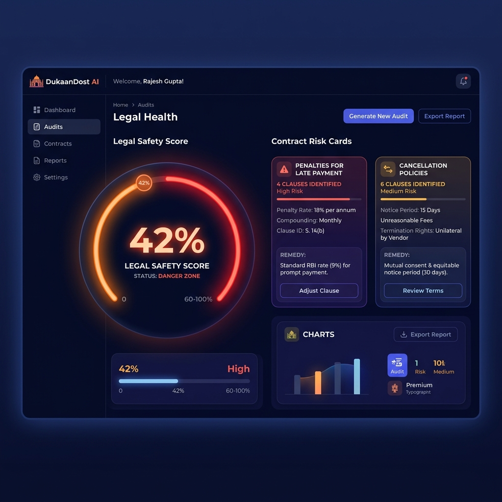

# DukaanDost AI ⚖️🤖
> **Agentic Legal Auditor for Bharat's Small Retail Merchants & MSMEs**

DukaanDost AI is a full-stack legal auditor application designed specifically for micro-merchants, shopkeepers, and MSMEs in India (Bharat). It helps them audit and understand complex business contracts (like Distributorship, Vendor, Lease, and Reseller agreements), highlighting predatory or one-sided clauses and generating formal legal counter-proposals to protect their profit margins.

---

## 📸 Project Showcase



### Live Demo Link
🔗 **Frontend Website**: [https://frontend-three-ashen-77.vercel.app](https://frontend-three-ashen-77.vercel.app)

---

## 💡 The Problem & The Solution
* **The Problem**: India has over 63 million MSMEs and retail shopkeepers. Most of them sign heavily one-sided distributorship agreements (e.g., 36% compound interest penalties, unilateral termination, out-of-station court jurisdictions) because they cannot afford professional legal services.
* **The Solution**: **DukaanDost AI** acts as a street-smart local legal companion. It parses the contract text, cross-checks it against the **Indian Contract Act, 1872** and **Consumer Protection Rules** using a **Retrieval-Augmented Generation (RAG)** engine, and delivers simplified Hinglish guidance, audio read-outs, and copy-pasteable counter-proposals.

---

## ✨ Key Features
1. **RAG Risk Score Meter**: Instantly calculates an overall `safety_score` (0-100) and displays a glowing SVG radial progress ring indicating risk status (Danger Zone, Warning, Safe).
2. **Dynamic Risk accent cards**: Cards auto-style themselves based on risk severity (Red left-border for High, Yellow for Medium, Green for Low).
3. **🔊 Suno (SpeechSynthesis API)**: Reads Hinglish advice out loud in a natural Indian accent (`hi-IN`) so shopkeepers don't have to read long documents.
4. **💡 Negotiation Assistant**: Provides clear, conversational advice on how to talk to the distributor and copy-pasteable legal English counter-proposals.
5. **🚨 One-Click WhatsApp Sharing**: Generates pre-formatted share links (`whatsapp_payload`) to instantly share audits with family, partners, or distributors.
6. **🤖 Interactive AI Assistant**: A sidebar chat interface to query specific sections of the agreement.

---

## 🛠️ Tech Stack
* **Frontend**: React.js (Vite), Tailwind CSS v4, Lucide Icons
* **Backend**: FastAPI (Python 3.9+), Uvicorn
* **RAG Database**: Local TF-IDF Vector Store with cosine similarity (falls back to offline mode gracefully if dependencies are missing).
* **AI Model**: Claude 3.5 Sonnet (supports offline mockup generator templates for cost-free testing).

---

## 🚀 Local Installation & Run

### 1. Backend Setup
1. Navigate to the root directory:
   ```bash
   cd dukaan-dost-ai
   ```
2. Install dependencies:
   ```bash
   pip install -r requirements.txt
   ```
3. Set your environment API key (optional, falls back to offline mockup templates if omitted):
   ```bash
   set ANTHROPIC_API_KEY="your-api-key"
   ```
4. Run the FastAPI server:
   ```bash
   python main.py
   ```
   *API will start listening at `http://127.0.0.1:8000`*

### 2. Frontend Setup
1. Navigate to the frontend directory:
   ```bash
   cd frontend
   ```
2. Install dependencies:
   ```bash
   npm install
   ```
3. Run the development server:
   ```bash
   npm run dev
   ```
   *Frontend will open at `http://localhost:5173/`*

---

## ☕ Scale-Up Architecture: Java Spring Boot Integration
While this prototype uses FastAPI for rapid Python-based RAG prototyping, the system is designed to scale using **Java Spring Boot** for production:
* **Controller Layer**: FastAPI endpoints can be easily ported to `@RestController` Spring Boot controllers.
* **Vector Storage**: Migrate the local TF-IDF matcher to a PostgreSQL database powered by **Spring Data JPA** and **pgvector** for high-performance semantic search.
* **Thread Management**: Utilize Spring Boot's multithreading capacity (`@Async`) to handle concurrent heavy PDF analysis from millions of shopkeepers.
* **Security**: Secure client data using **Spring Security** OAuth2 protocols.
